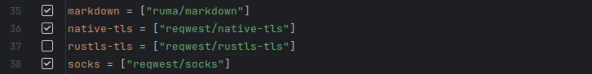

# Contributing to matrix-rust-sdk

## Chat rooms

In addition to our [main Matrix room], we have a development room at
[#matrix-rust-sdk-dev:flipdot.org]. Please use it to discuss potential changes,
the overall direction of development and related topics.

[main Matrix room]: https://matrix.to/#/#matrix-rust-sdk:matrix.org
[#matrix-rust-sdk-dev:flipdot.org]: https://matrix.to/#/#matrix-rust-sdk-dev:flipdot.org

## Testing

You can run most of the tests that also happen in CI also using
`cargo xtask ci`. This needs a few dependencies to be installed, as it also runs
automatic WASM tests:

```bash
rustup component add clippy
cargo install cargo-nextest typos-cli wasm-pack
```

If you want to execute only one part of CI, there are a few sub-commands (see
`cargo xtask ci --help`).

Some tests are not automatically run in `cargo xtask ci`, for example the
integration tests that need a running synapse instance. These tests reside in
`./testing/matrix-sdk-integration-testing`. See its
[README](./testing/matrix-sdk-integration-testing/README.md) to easily set up a
synapse for testing purposes.

## Commit messages and PR title guidelines

Ideally, a PR should have a *proper title*, with *atomic logical commits*, and each commit
should have a *good commit message*.

An *atomic logical commit* is one that is ideally small, can be compiled in isolation, and passes
tests. This is useful to make the review process easier (help your reviewer), but also when running
bisections, helping identifying which commit introduced a regression.

A *good commit message* should be composed of:

- a prefix to indicate which area/feature is related by the commit
- a short description that would give sufficient context for a reviewer to guess what the commit is
  about.

Examples of commit messages that aren't so useful:

- “add new method“
- “enhance performance“
- “fix receipts“

Examples of good commit messages:

- “ffi: Add new method `frobnicate_the_foos`”
- “indexeddb: Break up the request inside `get_inbound_group_sessions`”
- “read_receipts: Store receipts locally, fixing #12345”

A *proper PR title* would be a one-liner summary of the changes in the PR, following the
same guidelines of a good commit message, including the area/feature prefix. Something like
`FFI: Allow logs files to be pruned.` would be a good PR title.

(An additional bad example of a bad PR title would be `mynickname/branch name`, that is, just the
branch name.)

Having good commit messages and PR titles also helps with reviews, scanning the `git log` of
the project, and writing the [*This week in
Matrix*](https://matrix.org/category/this-week-in-matrix/) updates for the SDK.

## Sign off

In order to have a concrete record that your contribution is intentional
and you agree to license it under the same terms as the project's license, we've
adopted the same lightweight approach that the [Linux Kernel](https://www.kernel.org/doc/Documentation/SubmittingPatches),
[Docker](https://github.com/docker/docker/blob/master/CONTRIBUTING.md), and many other
projects use: the DCO ([Developer Certificate of Origin](http://developercertificate.org/)).
This is a simple declaration that you wrote the contribution or otherwise have the right
to contribute it to Matrix:

```
Developer Certificate of Origin
Version 1.1

Copyright (C) 2004, 2006 The Linux Foundation and its contributors.
660 York Street, Suite 102,
San Francisco, CA 94110 USA

Everyone is permitted to copy and distribute verbatim copies of this
license document, but changing it is not allowed.

Developer's Certificate of Origin 1.1

By making a contribution to this project, I certify that:

(a) The contribution was created in whole or in part by me and I
    have the right to submit it under the open source license
    indicated in the file; or

(b) The contribution is based upon previous work that, to the best
    of my knowledge, is covered under an appropriate open source
    license and I have the right under that license to submit that
    work with modifications, whether created in whole or in part
    by me, under the same open source license (unless I am
    permitted to submit under a different license), as indicated
    in the file; or

(c) The contribution was provided directly to me by some other
    person who certified (a), (b) or (c) and I have not modified
    it.

(d) I understand and agree that this project and the contribution
    are public and that a record of the contribution (including all
    personal information I submit with it, including my sign-off) is
    maintained indefinitely and may be redistributed consistent with
    this project or the open source license(s) involved.
```

If you agree to this for your contribution, then all that's needed is to
include the line in your commit or pull request comment:

```
Signed-off-by: Your Name <your@email.example.org>
```

Git allows you to add this signoff automatically when using the `-s` flag to
`git commit`, which uses the name and email set in your `user.name` and
`user.email` git configs.

If you forgot to sign off your commits before making your pull request and are
on Git 2.17+ you can mass signoff using rebase:

```
git rebase --signoff origin/main
```

## Tips for working on the `matrix-rust-sdk` with specific IDEs

* [RustRover](https://www.jetbrains.com/rust/) will attempt to sync the project
  with all features enabled, causing an error in `matrix-sdk` ("only one of the
  features 'native-tls' or 'rustls-tls' can be enabled"). To work around this,
  open `crates/matrix-sdk/Cargo.toml` in RustRover and uncheck one of the
  `native-tls` or `rustls-tls` feature definitions:

  
